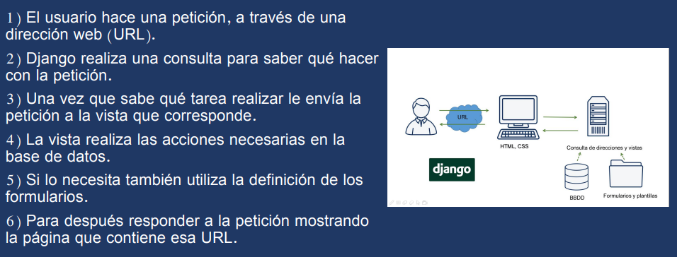

Primeros pasos:
# Material de apoyo para Django Framework
- [Framework Web Django](https://developer.mozilla.org/es/docs/Learn/Server-side/Django)
- [Documentacion Django Project](https://www.djangoproject.com/)

--- 
 

# Instrucciones para poder ejecutar nuestra aplicación
## Creación entorno virtual
- Crear el entorno virtual: virtualenv my_django_app
- Entrar en el entorno virtual: source my_django_app/bin/activate

# Instalación requerimientos.
- Instalación de requerimientos: pip install -r requirements.txt    

# Migración de SQLite.
- migrar la base de datos: python manage.py makemigrations myApp
- python manage.py migrate

## Runserver
- Correr la aplicación: python manage.py runserver

## Creación de superusuario
- Crear superusuario: python manage.py createsuperuser

## Salir env y eliminación
- Cerrar el entorno virtual: deactivate
- eliminar el entorno virtual: sudo rm -rf my_django_app

## Internalización
- Crear archivo (.po) de traducción: django-admin makemessages -l es
- Compile messages (.mo): django-admin compilemessages
